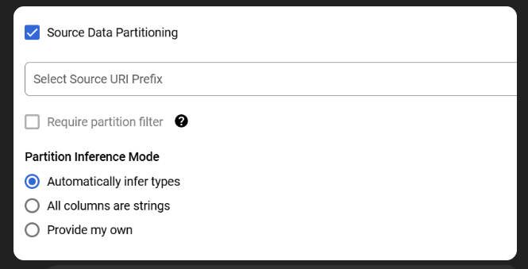

### Do i need to add index in big query table to get a faster query speed?

No, you do not need to add traditional indexes in BigQuery. BigQuery is a columnar, distributed data warehouse that automatically optimizes query performance through its architecture. It handles data storage and retrieval differently from traditional relational databases.

For Faster Query Performance:
Partitioning: Use partitioned tables to reduce the amount of data scanned during queries.
Clustering: Apply clustering on frequently filtered or joined columns to improve performance.
Denormalization: Flatten your data where possible to reduce complex joins.
Materialized Views: Use materialized views for pre-aggregated data.
Query Optimization: Optimize SQL queries with proper filtering, avoiding SELECT *, and using approximate aggregation functions like APPROX_COUNT_DISTINCT.
Let me know if you need help implementing any of these strategies.

### https://www.youtube.com/watch?v=T2CS9a63LOM

### why we have both where and having in sql
reference: https://www.youtube.com/watch?v=BHwzDmr6d7s&t=1s

*WHERE Clause:*

Purpose: Filters rows before any grouping or aggregation occurs.
Used with: Regular columns (not aggregate functions like COUNT(), SUM(), etc.).

*HAVING Clause:*

Purpose: Filters groups after aggregation (GROUP BY) has been applied.
Used with: Aggregate functions (COUNT(), SUM(), AVG(), etc.).

SELECT department, COUNT(*) AS employee_count
FROM employees
GROUP BY department
HAVING COUNT(*) > 10;

### how many ways to Load Data from GCS to BigQuery
reference: https://medium.com/@santosh_beora/loading-data-from-gcs-to-bigquery-a-comprehensive-guide-62b5d3abea53

BigQuery Console
- Ease : High
- Efficiency : Medium
- Optimization : Low

Pros :
- User-friendly, no coding required.
- Suitable for quick, one-time data loads.
- Good for small to medium-sized data.

Cons :
- Manual process, not suitable for automation.
- Limited optimization options.
- Not ideal for large-scale or frequent data loads.

Best for : Quick, ***ad-hoc*** data loads or if you’re new to BigQuery.

bq Command-Line Tool
- Ease : Medium
- Efficiency : High
- Optimization : Medium

Pros :
- Scriptable and automatable.
- Efficient for handling large datasets.
- Can be integrated into CI/CD pipelines.

Cons :
- Requires familiarity with command-line tools.
- Slight learning curve for those not used to scripting.

Best for : Automated workflows, ***large datasets***, and integration into existing scripts and pipelines.

bq SQL Code
- Ease : Medium
- Efficiency : High
- Optimization : Medium

Pros :
- Directly use SQL within BigQuery.
- Easy to embed in SQL-based workflows.
- Good for users comfortable with SQL.

Cons :
- Limited to SQL’s capabilities for error handling and complex transformations.
- May require additional steps for schema management.

Best for : SQL-centric environments and when working within BigQuery’s SQL editor or embedding in other SQL scripts.

### what is Partition Inference Mode meaning here

Partition Inference Mode in this context refers to how BigQuery will identify and interpret partition information from the data stored in Google Cloud Storage (GCS), typically when loading partitioned data based on folder structure or file naming conventions.

⚡ Explanation of the Options:
Automatically Infer Types (Selected):

BigQuery will automatically detect partition columns and their data types based on folder or file names.
Example:
bash
Copy
Edit
gs://bucket/sales_data/date=2023-01-01/region=US/file.csv
BigQuery will infer:
date as a DATE type
region as a STRING type
All Columns Are Strings:

BigQuery will treat all partition columns as STRING, regardless of the actual data format.
Useful if you prefer to handle type conversion manually later.
Provide My Own:

You can manually specify the partition columns and their data types.
Ideal for strict schema control or when automatic inference doesn’t behave as expected.
🚀 When to Use Each Mode:
Automatically Infer Types: Quick, efficient, works well for standardized file structures.
All Columns Are Strings: When data types are inconsistent or not critical initially.
Provide My Own: For precise control, especially in production environments with strict data governance.
Let me know if you'd like more examples or details!

### 

### 2025-02-06 [GCP Data Engineer Mock interview](https://www.youtube.com/watch?v=qZwffdeu1sY)

_______________________________________________________________
### 2025-02-06 22:07:45 Could you please explain the high-level architecture of BigQuery?
BigQuery is a data warehousing tool designed for analytical purposes. It has a ***Aseparation of storage and compute***, meaning they operate independently. BigQuery uses columnar storage (OLAP) instead of traditional row-based (OLTP) storage. This enables efficient querying because it scans only the specific columns needed, improving performance.
_______________________________________________________________