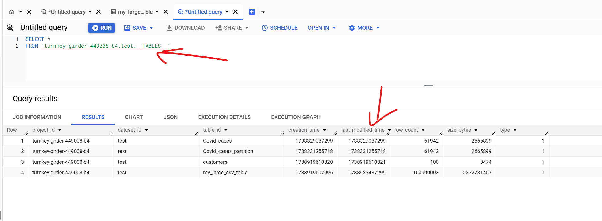
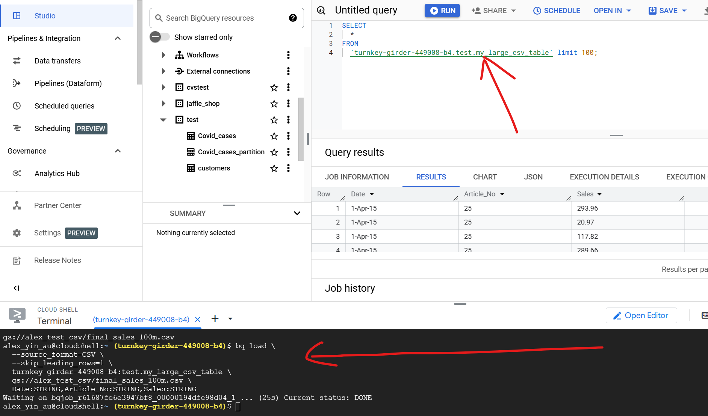

### 2025-02-06 22:17:21 [GCP Data Engineer Mock interview](https://www.youtube.com/watch?v=qZwffdeu1sY)
reference:xxxxx
xxxxx
_______________________________________________________________
### 2025-02-06 22:07:45 Could you please explain the high-level architecture of BigQuery?
BigQuery is a data warehousing tool designed for analytical purposes. It has a ***separation of storage and compute***, meaning they operate independently. BigQuery uses ***columnar storage*** (OLAP) instead of traditional row-based (OLTP) storage. This enables efficient querying because it ***scans only the specific columns needed***, improving performance.
_______________________________________________________________
### 2025-02-06 22:12:05 Do i need to add index in big query table to get a faster query speed?
No, you do not need to add traditional indexes in BigQuery. BigQuery is a columnar, distributed data warehouse that automatically optimizes query performance through its architecture. It handles data storage and retrieval differently from traditional relational databases.

For Faster Query Performance:
Partitioning: Use partitioned tables to reduce the amount of data scanned during queries.
Clustering: Apply clustering on frequently filtered or joined columns to improve performance.
Denormalization: Flatten your data where possible to reduce complex joins.
Materialized Views: Use materialized views for pre-aggregated data.
Query Optimization: Optimize SQL queries with proper filtering, avoiding SELECT *, and using approximate aggregation functions like APPROX_COUNT_DISTINCT.
_______________________________________________________________
### 2025-02-06 22:13:29 why we have both where and having in sql
reference: https://www.youtube.com/watch?v=BHwzDmr6d7s&t=1s

*WHERE Clause:*

Purpose: Filters rows before any grouping or aggregation occurs.
Used with: Regular columns (not aggregate functions like COUNT(), SUM(), etc.).

*HAVING Clause:*

Purpose: Filters groups after aggregation (GROUP BY) has been applied.
Used with: Aggregate functions (COUNT(), SUM(), AVG(), etc.).

SELECT department, COUNT(*) AS employee_count
FROM employees
GROUP BY department
HAVING COUNT(*) > 10;
_______________________________________________________________
### 2025-02-06 22:16:06 how many ways to Load Data from GCS to BigQuery
reference:[https://medium.com/@santosh_beora/loading-data-from-gcs-to-bigquery-a-comprehensive-guide-62b5d3abea53](https://medium.com/@santosh_beora/loading-data-from-gcs-to-bigquery-a-comprehensive-guide-62b5d3abea53)
xxxxx
_______________________________________________________________
### 2025-02-06 22:19:54 How can we optimize performance in BigQuery?
reference: xxxxx

Partitioning: Organize large tables by date or other logical partitions to reduce the amount of data scanned.
Clustering: Group related data together to improve query performance when filtering by clustered columns.
Query Optimization: Use filters (WHERE conditions), avoid SELECT *, and limit data processed.
_______________________________________________________________
### 2025-02-06 22:20:46 In terms of cost optimization, how can we save costs in BigQuery?
reference: [Cost optimization best practices for BigQuery](https://www.youtube.com/watch?v=cZgTavxWO2k)

Reserved Slots: Purchase slots in advance for predictable workloads to reduce costs.
Optimize Queries: Use partitioning and clustering to reduce data scanned.
Storage Optimization: Move rarely accessed data to cheaper storage like Cloud Storage (Nearline/Coldline).
_______________________________________________________________
### 2025-02-06 23:08:11 For example, if we have thousands of datasets and tables that people are not using anymore, how can we identify the unused datasets and tables? What would be your action plan and point of view to save costs in such cases?
reference: xxxxx

1. Identify Unused Tables:
- Use BigQuery Information Schema to check the last access times.

- Analyze Cloud Audit Logs for usage patterns.
2. Action Plan:
- Archive unused tables to Cloud Storage (Nearline or Coldline) to reduce costs.
- Regularly review and clean up unused datasets.
_______________________________________________________________
### 2025-02-07 21:20:36 how to use `bq load` ingest a 2G csv into bigquery
reference: xxxxx


xxxxx
_______________________________________________________________
### 2025-02-09 18:16:56 What are Slots in BigQuery?
reference: xxxxx

A slot in Google BigQuery is a unit of computational capacity that BigQuery uses to process queries.

**🔹 1️⃣ How Slots Work**


-   Each query **consumes slots** based on its complexity.
-   Queries run in parallel using available slots.
-   **More slots → Faster queries**, but at a higher cost.

**🔹 2️⃣ Types of Slot Allocation in BigQuery**


BigQuery offers **two main slot allocation modes**:

| Mode | Description | Pricing |
| --- |  --- |  --- |
| **On-Demand Pricing (Default)** | BigQuery automatically assigns slots based on query demand. | Pay **per TB scanned** (e.g., `$5 per TB`). |
| --- |  --- |  --- |
| **Capacity-Based (Slot Reservation)** | You purchase **dedicated slots** for predictable performance. | Fixed cost (e.g., **500 slots** at **$10,000/month**). |

**🔹 3️⃣ Understanding Slot Reservation**


Slot reservation allows you to **buy and allocate slots** to control query performance.

### **Example: Buying Slots**

If your queries are **slow due to high demand**, you can reserve slots:

```
sh
CopyEdit

`bq mk --reservation --project_id=my_project --slots=500 my_reservation
`

```

📌 **This reserves 500 slots for your queries.**

### **Assigning Slots to a Query**

You can force a query to use a specific reservation:

```
sql
CopyEdit

`SELECT * FROM my_dataset.my_table
OPTIONS (resource_group='my_reservation');
`

```

* * * *

**🔹 4️⃣ How Many Slots Does a Query Use?**


-   **Simple queries** (e.g., small `SELECT`) → Use **few slots**.
-   **Complex joins, aggregations, large data scans** → Use **many slots**.

📌 **To check slot usage in BigQuery UI:**

1.  Run a query.
2.  Go to **Query Execution Details** → **Performance** → **Slot Usage**.

* * * *

**🔹 5️⃣ Slot Pricing & Cost Optimization**


| Approach | Cost | When to Use? |
| --- |  --- |  --- |
| **On-Demand (Default)** | Pay per **TB scanned** | For low or unpredictable query workloads. |
| --- |  --- |  --- |
| **Flex Slots** | **Short-term (per second) slot purchase** | For **temporary high demand** (cheaper than on-demand for heavy queries). |
| **Flat-Rate Slots** | Fixed cost per month | For **consistent, high-volume workloads**. |

* * * *

**🔹 6️⃣ Best Practices for Slot Optimization**


✔ **Use partitions & clustering** to reduce slot consumption.
✔ **Limit `ORDER BY`, `JOIN`, `GROUP BY` on large datasets.**
✔ **Precompute & cache results** to reduce slot usage.
✔ **Monitor slot usage in BigQuery UI** → Identify **slow queries**.
✔ **Consider Flex Slots for cost savings** if running heavy queries.
_______________________________________________________________
### 2025-02-09 20:13:50 Difference Between a Normal View and a Materialized View in BigQuery
reference: [STANDARD vs. MATERIALIZED views in SQL | BigQuery](https://www.youtube.com/watch?v=wnFBAE4auVc&t=121s)

**🔹 1️⃣ Normal View (Standard View)**


A **normal view** in BigQuery is a **logical layer** that stores **only the query definition**, not the data. Every time you query a normal view, **BigQuery re-runs the underlying query**.

### **📌 Example: Creating a Normal View**

```
sql
CopyEdit

`CREATE VIEW my_dataset.customer_view AS
SELECT customer_id, name, total_spent
FROM my_dataset.customers
WHERE total_spent > 100;
`

```

📌 **Key Characteristics of Normal Views**

-   **💾 Storage:** **No additional storage** (only metadata is stored).
-   **⚡ Performance:** **Slower** because the underlying query runs every time.
-   **💲 Cost:** **Higher cost** as you pay for scanning the base table every time.
-   **🔄 Freshness:** **Always up to date** (real-time).
-   **⚙️ Indexing & Partitioning:** **Not supported.**

* * * *

**🔹 2️⃣ Materialized View**


A **materialized view (MV)** stores **the query results as precomputed data**.
Instead of recomputing the query every time, **BigQuery reads the precomputed results**, making queries much **faster and cheaper**.

### **📌 Example: Creating a Materialized View**

```
sql
CopyEdit

`CREATE MATERIALIZED VIEW my_dataset.mv_customer_summary AS
SELECT customer_id, COUNT(*) AS order_count, SUM(total_spent) AS total_spent
FROM my_dataset.orders
GROUP BY customer_id;
`

```

📌 **Key Characteristics of Materialized Views**

-   **💾 Storage:** Stores **precomputed** query results (takes up space).
-   **⚡ Performance:** **Faster queries** (precomputed results reduce processing time).
-   **💲 Cost:** **Lower cost** (reads from the MV instead of scanning the whole table).
-   **🔄 Freshness:** **Not real-time** (MV updates automatically but on a schedule).
-   **⚙️ Indexing & Partitioning:** **Supports clustering and partitioning**.
_______________________________________________________________
### 2025-02-09 21:06:02 why APPROX_COUNT_DISTINCT can speed up query?
reference: xxxxx

In BigQuery, `APPROX_COUNT_DISTINCT` is a **faster alternative** to `COUNT(DISTINCT column)`, and it speeds up queries because:

1.  **✅ Uses Approximate Algorithms (HyperLogLog++)**

    -   Instead of **scanning the entire dataset**, BigQuery uses **probabilistic counting** (HyperLogLog++) to estimate the distinct count.
    -   This reduces **CPU usage** and **memory consumption**.
2.  **✅ Avoids Expensive Sorting & Deduplication**

    -   `COUNT(DISTINCT column)` requires:
        -   **Sorting the data** (which is expensive for large tables).
        -   **Deduplication** (which increases processing time).
    -   `APPROX_COUNT_DISTINCT(column)` **does not require sorting**, making it much **faster**.
3.  **✅ Works in Streaming & Partitioned Queries**

    -   **`COUNT(DISTINCT)` is slow** in **streaming** or **partitioned queries** because it needs **global deduplication**.
    -   `APPROX_COUNT_DISTINCT` works **efficiently** even in **distributed queries**.
4.  **✅ Uses Less Memory & Compute Resources**

    -   **`COUNT(DISTINCT)` stores every unique value**, increasing **RAM usage**.
    -   **`APPROX_COUNT_DISTINCT` stores only a compressed hash of values**, reducing memory needs.


### **📌 Performance Comparison**

#### **1️⃣ Normal `COUNT(DISTINCT)`**

```
sql
CopyEdit

`SELECT COUNT(DISTINCT user_id)
FROM my_dataset.events;
`

```

-   **Slower** for large tables (due to sorting & deduplication).
-   **Expensive** in terms of processing costs.

#### **2️⃣ Faster `APPROX_COUNT_DISTINCT`**

```
sql
CopyEdit

`SELECT APPROX_COUNT_DISTINCT(user_id)
FROM my_dataset.events;
`

```

-   **5-50x faster** 🚀.
-   **Slight margin of error (~0.1% - 0.5%)**, but much **cheaper**.


### **💡 When to Use `APPROX_COUNT_DISTINCT`?**

| **Use Case** | **Recommended Function** |
| --- |  --- |
| ✅ Need **100% accuracy** | `COUNT(DISTINCT column)` |
| --- |  --- |
| ✅ Need **fast & cheap** results (minor inaccuracy is okay) | `APPROX_COUNT_DISTINCT(column)` |
| ✅ Working with **large datasets** | `APPROX_COUNT_DISTINCT(column)` |
| ✅ Need **real-time analytics** | `APPROX_COUNT_DISTINCT(column)` |
_______________________________________________________________
### 2025-02-09 21:16:15 What is an Authorized View?
reference: xxxxx

An **Authorized View** allows you to **securely share specific columns or rows** from a dataset **without granting full access** to the base table.

### **📌 Example: Creating an Authorized View**

Let's say **we have a `customers` table**, but we **only want to share `customer_id` and `name`** with external users.

```
sql
CopyEdit

`CREATE VIEW my_dataset.auth_view_customer AS
SELECT customer_id, name
FROM my_dataset.customers;
`

```

Now, **grant access to the view** without exposing the full table:

```
sh
CopyEdit

`bq add-iam-policy-binding my_project:my_dataset\
  --member=user:external_user@gmail.com\
  --role=roles/bigquery.dataViewer
`

```

✅ **Benefits of Authorized Views**:

-   **Controls access** to sensitive data (only exposes selected fields).
-   **Users can query the view** without accessing the base table.
-   **Data is always fresh** (query runs in real-time).
_______________________________________________________________
### 2025-02-09 21:29:14 how can I only expose the authorised view to the user but hide the table
reference: xxxxx

**🔹 1️⃣ Remove Direct Access to `my_dataset.customers`**


By default, if the user has `roles/bigquery.dataViewer` on `my_dataset`, they can access **all tables** in the dataset, including `customers`.

### **✅ Solution: Remove Dataset-Level Permissions**

To **remove their access to the base table (`customers`)**:

```
sh
CopyEdit

`bq remove-iam-policy-binding my_project:my_dataset\
   --member=user:external_user@gmail.com\
   --role=roles/bigquery.dataViewer
`

```

📌 **This ensures the user has no direct access to `my_dataset.customers`**.


**🔹 2️⃣ Grant Access ONLY to the Authorized View**


Now, **grant access to just the Authorized View (`auth_view_customer`)**:

```
sh
CopyEdit

`bq add-iam-policy-binding my_project:my_dataset.auth_view_customer\
   --member=user:external_user@gmail.com\
   --role=roles/bigquery.dataViewer
`

```

📌 **Now, the user can only see `auth_view_customer`, not the `customers` table**.
_______________________________________________________________
### 2025-02-10 12:33:05 Partitioning vs Clustering in BigQuery
reference: xxxxx

| Feature | Partitioning | Clustering |
| --- |  --- |  --- |

| **How it Works** | Divides a table into **separate partitions** | **Organizes data within partitions** for efficient filtering |
| --- |  --- |  --- |

| **Query Optimization** | Reduces the number of **rows scanned** | Reduces the number of **blocks read** |
| --- |  --- |  --- |

| **Best for** | Queries filtering on **date/time** or **integer ranges** | Queries filtering or sorting on **high-cardinality fields** |
| --- |  --- |  --- |

| **Max Columns** | **1 partition column** per table | **Up to 4 clustering columns** |
| --- |  --- |  --- |

| **Max Partitions** | **4,000 partitions per table** | No limit |
| --- |  --- |  --- |

| **Storage Cost** | Each partition is **stored separately** | Clustering **automatically sorts data inside partitions** |
| --- |  --- |  --- |

| **Performance Boost** | If queries filter on **partition column** | If queries filter/sort on **clustered columns** |
| --- |  --- |  --- |
_______________________________________________________________