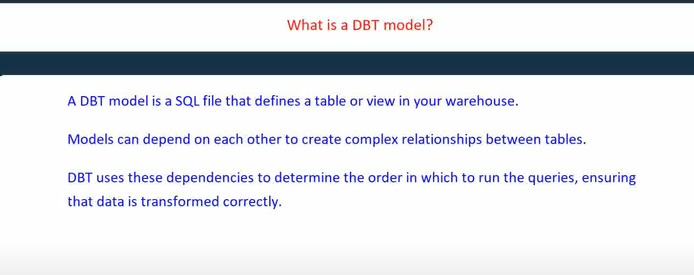
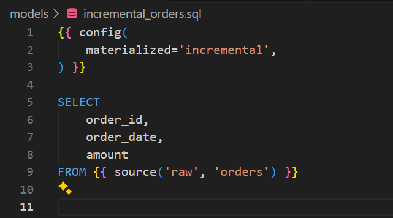
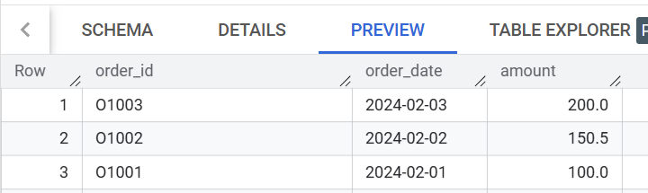
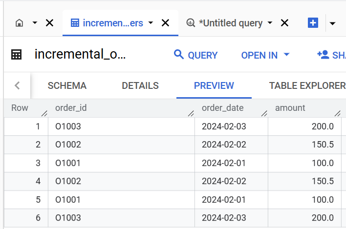
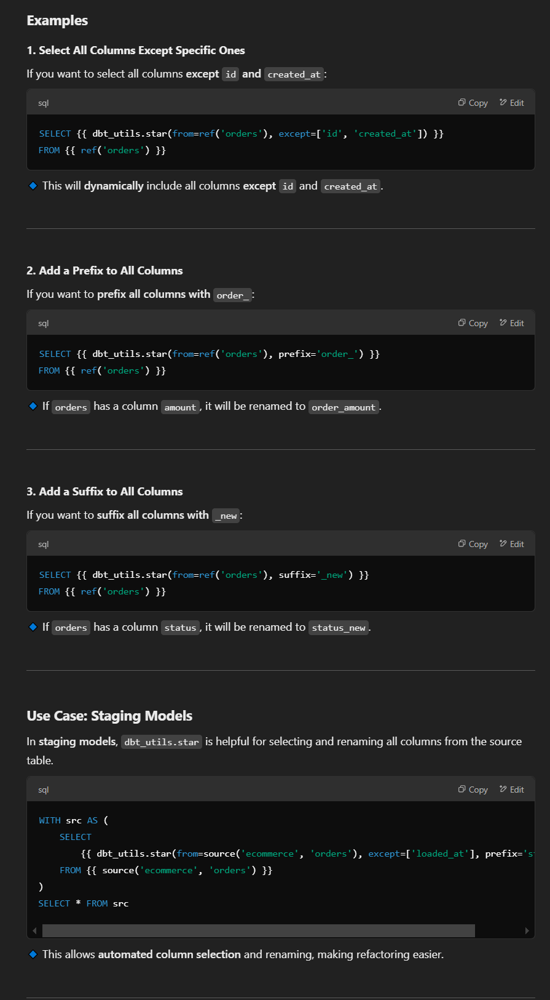

https://www.youtube.com/watch?v=G3t0EF6hMkQ

https://www.youtube.com/watch?v=DWHdT2qQgxI

https://www.youtube.com/watch?v=5mDutGU24MU&t=22s

https://www.youtube.com/watch?v=T2CS9a63LOM

### 2025-02-07 13:35:11 how to use dbt package dbt-external-tables to ingest a big csv to big query
reference: xxxxx

xxxxx
_______________________________________________________________
### 2025-02-07 21:20:36 how to use `bq load` ingest a 2G csv into bigquery
reference: xxxxx


xxxxx
_______________________________________________________________
### 2025-02-07 21:25:21 What is a DBT Model?
reference: [https://youtu.be/G3t0EF6hMkQ?t=83](https://youtu.be/G3t0EF6hMkQ?t=83)

A DBT model is a .sql file that contains SELECT statements, WITH clauses, or Common Table Expressions (CTEs). When you run a DBT model, a table or view is created based on the materialization property.

_______________________________________________________________
### 2025-02-07 21:29:28 what is dbt macro
reference: xxxxx

 a macro is a reusable piece of SQL or Jinja code that can be called within dbt models, tests, analyses, or other macros
_______________________________________________________________
### 2025-02-08 21:44:16 what will the following incremental modal create in big query?

reference: xxxxx

by default, dbt uses Append-Only strategy, New records are inserted without checking for duplicates.<br>
before:<br>
 
after dbt run:<br>

_______________________________________________________________
### 2025-02-08 21:55:11 do you use any dbt packages by any chance?
reference: xxxxx

dbt_utils – A must-have package that provides utility macros for common transformations like safe casting, generating surrogate keys, pivoting, and unpivoting.

dbt-unit-testing - allows writing unit tests in YAML with mocked inputs and expected outputs.
_______________________________________________________________
### 2025-02-08 22:08:30 How to Use dbt_utils.star in dbt?
reference: xxxxx


_______________________________________________________________
### 2025-02-08 22:28:44 What's the difference between view and table?
reference: xxxxx

👉 **A view is not a physical table; it is just a stored query.**

-   The data **is not stored** in BigQuery (or other databases).
-   Every time you query the view, it **reruns the underlying SQL**.
-   It is **always up-to-date** because it dynamically fetches data from the source.

### **🚀 Pros of `view`**

✅ **No storage cost** -- Since it doesn't store data, you save storage fees in BigQuery.
✅ **Always up-to-date** -- Every query pulls the latest data from the source.
✅ **Good for lightweight transformations** -- Ideal for simple data reshaping.

### **⚠️ Cons of `view`**

❌ **Slow for large datasets** -- Since it recomputes every time, queries take longer.
❌ **No indexing or optimization** -- Performance may be worse than a table.
❌ **Query cost can increase** -- Every query runs the full SQL, leading to higher BigQuery processing
_______________________________________________________________
### 2025-02-09 09:49:05 what is the difference between `dbt run` and `dbt build`?
reference: xxxxx

The key difference between `dbt run` and `dbt build` is that `dbt build` is a more comprehensive command that includes `dbt run`, `dbt test`, and `dbt snapshot`, whereas `dbt run` only executes models.
_______________________________________________________________
### 2025-02-09 10:00:33 what is `schema` equivalent in bigquery?
reference: xxxxx

schema is interchangeable with the BigQuery concept dataset
database is interchangeable with the BigQuery concept of project
_______________________________________________________________
### 2025-02-09 11:05:18 what is dbt snapshot?
reference: [How to use dbt Snapshots to track data history](https://youtu.be/SNtM_RUa5G4?t=469)

`dbt snapshot` is a feature in **dbt** that helps track historical changes in **slowly changing dimensions (SCDs)** within a database. It captures and preserves changes to records over time by maintaining **previous versions** of data whenever updates occur.
_______________________________________________________________
### 2025-02-09 12:35:55 what is Jinja templating language
reference: xxxxx

Jinja is a **templating language** used to dynamically generate text, typically **HTML, SQL, or configuration files**. It allows embedding logic, variables, loops, and conditionals inside a text-based document.

Jinja is widely used in:

-   **Web development** (e.g., Flask, Django templates)
-   **Infrastructure automation** (e.g., Ansible playbooks)
-   **Data transformation** (e.g., dbt for SQL generation)
```
Hello, {{ name }}!
```

```html

  - {{ user.name }} ({{ user.email }})

```

```html

  You are an adult.

  You are a minor.

```

```yaml
{{ name | upper }}  # Converts to uppercase
{{ price | round(2) }}  # Rounds to 2 decimal places
{{ date | date('Y-m-d') }}  # Formats a date
```

```html

  Hello, {{ name }}!

```
_______________________________________________________________
### 2025-02-09 15:45:14 What is SQLFluff?
reference: xxxxx

[SQLFluff](https://github.com/sqlfluff/sqlfluff) is an **open-source SQL linter and formatter** that ensures SQL code follows **best practices, style consistency, and readability**.

It is especially useful for **dbt projects** because it can: ✔ **Lint** SQL models to detect syntax errors
✔ **Auto-format** SQL files for better readability
✔ **Enforce team-wide SQL style guides**
✔ **Validate Jinja-templated SQL in dbt models**
_______________________________________________________________
### 2025-02-09 16:37:25 How to Run dbt in Debug Mode?
reference: xxxxx

- dbt debug
- dbt run --debug
- logs/dbt.log
- dbt test --debug
_______________________________________________________________