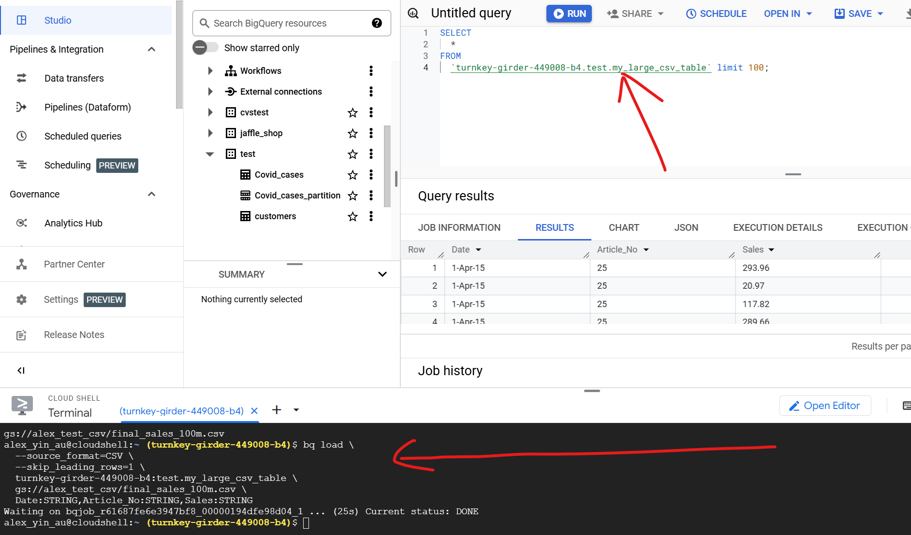

https://www.youtube.com/watch?v=G3t0EF6hMkQ

https://www.youtube.com/watch?v=DWHdT2qQgxI

https://www.youtube.com/watch?v=5mDutGU24MU&t=22s

https://www.youtube.com/watch?v=T2CS9a63LOM

### 2025-02-07 13:35:11 how to use dbt package dbt-external-tables to ingest a big csv to big query
reference: xxxxx

xxxxx
_______________________________________________________________
### 2025-02-07 21:20:36 how to use `bq load` ingest a 2G csv into bigquery
reference: xxxxx

xxxxx
_______________________________________________________________
### 2025-02-07 21:25:21 What is a DBT Model?
reference: [https://youtu.be/G3t0EF6hMkQ?t=83](https://youtu.be/G3t0EF6hMkQ?t=83)

A DBT model is a .sql file that contains SELECT statements, WITH clauses, or Common Table Expressions (CTEs). When you run a DBT model, a table or view is created based on the materialization property.

_______________________________________________________________
### 2025-02-07 21:29:28 what is dbt macro
reference: xxxxx

 a macro is a reusable piece of SQL or Jinja code that can be called within dbt models, tests, analyses, or other macros
_______________________________________________________________
### 2025-02-08 21:44:16 what will the following incremental modal create in big query?

reference: xxxxx

by default, dbt uses Append-Only strategy, New records are inserted without checking for duplicates. 
before: 
 
after dbt run: 

_______________________________________________________________
### 2025-02-08 21:55:11 do you use any dbt packages by any chance?
reference: xxxxx

dbt_utils – A must-have package that provides utility macros for common transformations like safe casting, generating surrogate keys, pivoting, and unpivoting.

dbt-unit-testing - allows writing unit tests in YAML with mocked inputs and expected outputs.
_______________________________________________________________
### 2025-02-08 22:08:30 How to Use dbt_utils.star in dbt?
reference: xxxxx

_______________________________________________________________
### 2025-02-08 22:28:44 What's the difference between view and table?
reference: xxxxx

👉 **A view is not a physical table; it is just a stored query.**

-   The data **is not stored** in BigQuery (or other databases).
-   Every time you query the view, it **reruns the underlying SQL**.
-   It is **always up-to-date** because it dynamically fetches data from the source.

### **🚀 Pros of `view`**

✅ **No storage cost** -- Since it doesn't store data, you save storage fees in BigQuery.
✅ **Always up-to-date** -- Every query pulls the latest data from the source.
✅ **Good for lightweight transformations** -- Ideal for simple data reshaping.

### **⚠️ Cons of `view`**

❌ **Slow for large datasets** -- Since it recomputes every time, queries take longer.
❌ **No indexing or optimization** -- Performance may be worse than a table.
❌ **Query cost can increase** -- Every query runs the full SQL, leading to higher BigQuery processing
_______________________________________________________________