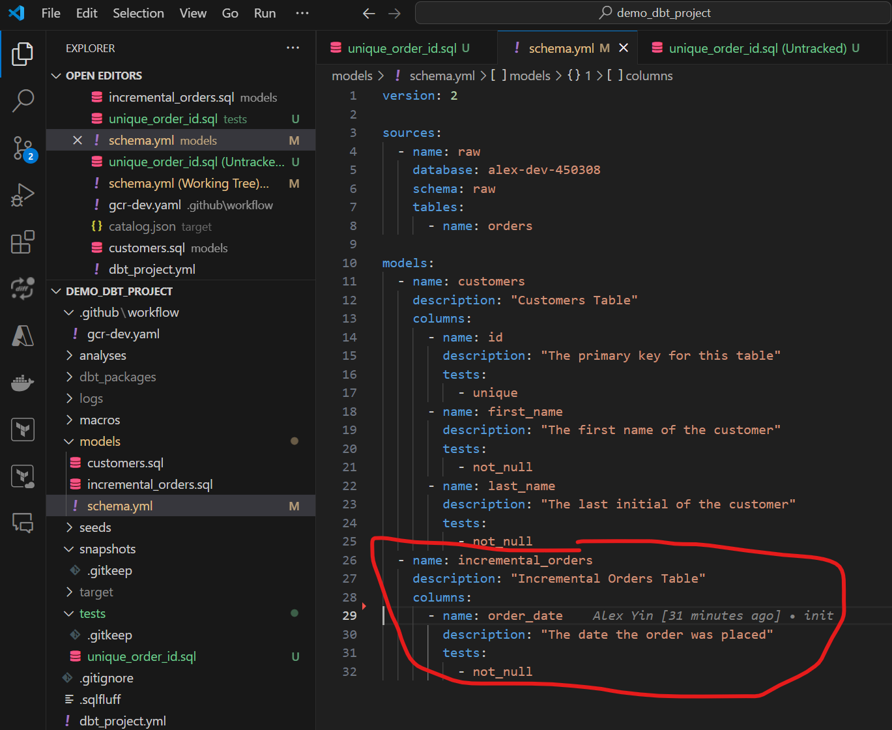
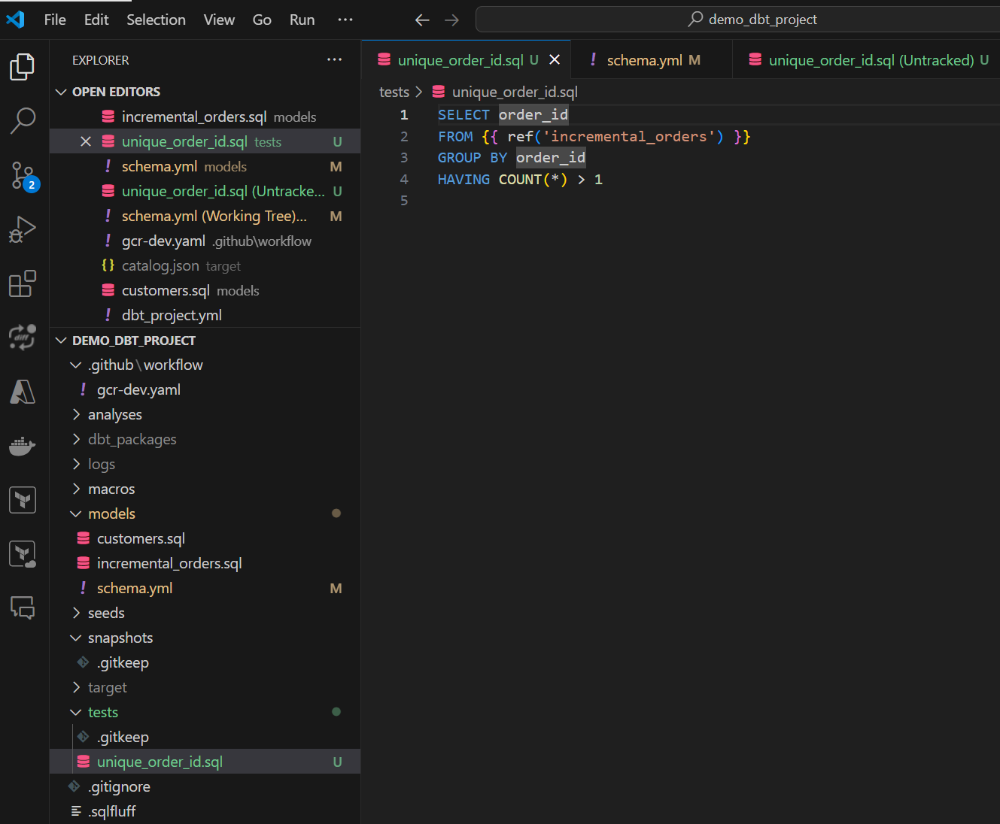

### 2025-02-09 13:05:30 this is more like a think of this as a scenario like a you know what if um so let's say you have a ticket which comes to you and it says on our dashboard there's duplicate customers so how would you responds to that ticket as a data engineer
reference: xxxxx

- start by checking the SQL queries or logic behind the dashboard to see how the customer data is being aggregated or filtered
- copy this query into bigquery and debug this query
- if the query is correct, then we can check the fact table, there are 2 possibilities here:
- data source is wrong, have duplicate row, need to communicate with the other squad, let them know
- ETL pipeline has a bug
_______________________________________________________________
### 2025-02-09 14:37:39 are there any aspects of DBT which might be able to help you in looking this issue

reference: xxxxx

- Built-in Tests: DBT offers built-in tests that can help you identify duplicates. You can use unique tests to ensure that a specific column, like customer\_id, is unique across the dataset. If the test fails, it's a clear indication that duplicates exist.

- Custom Tests: You can create custom tests in DBT to check for specific conditions that might lead to duplicates. For example, you can write a test to check for rows where a combination of fields (like customer\_name and email) should be unique but isn't.

_______________________________________________________________
### 2025-02-09 16:47:07 say if you've got a junior developer on your team and they saw the issue and they just want to delete the duplicate customers so as a senior data engineer, how would you coach or respond to your Junior teammate who just wants to just delete the duplicate rows, what would you say
reference: xxxxx

**

1.  Understanding the Root Cause:

-   If we simply delete the duplicates without understanding how they got there, the problem could easily recur. It's essential that we diagnose the issue properly to prevent it from happening again. This might involve reviewing the ETL pipeline, checking the transformation logic in DBT, or investigating the source data.

3.  Ensuring Data Integrity:

-   Deleting rows without fully understanding their context might lead to unintended data loss or inconsistencies. We need to ensure that the rows we're deleting are truly duplicates and not legitimate records that just happen to look similar. This often requires a thorough analysis of the data.

5.  Building a Sustainable Solution:

-   Instead of just fixing the symptom, let's focus on addressing the root cause by implementing robust deduplication logic in our pipeline. We can use tools like DBT to enforce uniqueness, and set up tests to catch these issues early in the development process. This way, we can ensure that our solution is not only correct but also sustainable.

7.  Learning Opportunity:

-   This is a great opportunity for us to dive deeper into data quality practices and learn more about how to prevent issues like this in the future. Let's work together to trace the data lineage, identify where the duplication is happening, and fix the process rather than just the data.

**
_______________________________________________________________